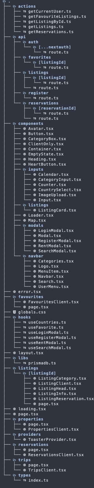
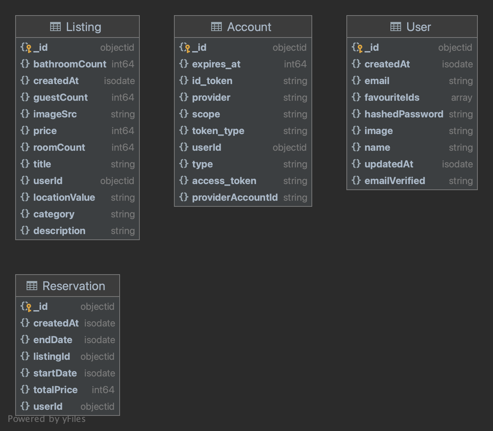

Fully Functional <b>Airbnb Clone</b>
<br/>


<br/>

## Tech Stack

<div align="center">


</div>

## Tools Used

<div align="center">


</div>

<br/>
<br/>

<a href="https://www.figma.com/community/file/1206705782258966386/airbnb-ui-kit" target="_blank">

</a>

The UI for this site was replicated from the above Figma file.

This is a [Next.js](https://nextjs.org/) project bootstrapped with [`create-next-app`](https://github.com/vercel/next.js/tree/canary/packages/create-next-app).

## Getting Started

First, install the dependencies:

```bash
npm install
# or
yarn install
```

Then create a .env file, and fill your respective credentials:

```bash
DATABASE_URL="your_mongo_url"
NEXTAUTH_SECRET="SOME_RANDOM_SECRET"
GOOGLE_CLIENT_ID=
GOOGLE_CLIENT_SECRET=
NEXT_PUBLIC_CLOUDINARY_CLOUD_NAME=""
```

Generate your Prisma Schema and Push it to MongoDB:

```bash
npx primsa generate
```

```bash
npx primsa db push
```

Run the dev server:

```bash
npm run dev
#or
yarn run dev
```

Open [http://localhost:3000](http://localhost:3000) with your browser to see the result.

## File Structure



## DB Schemas



<hr/>
<br/>

Deployed on


